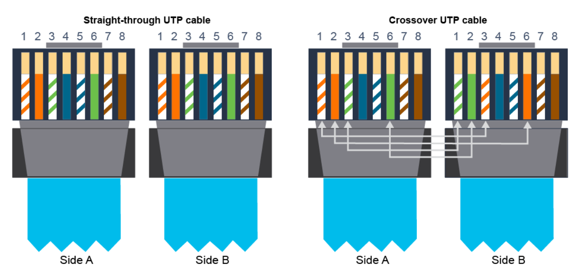
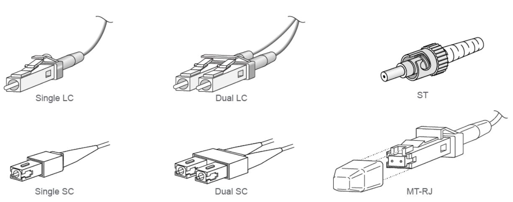
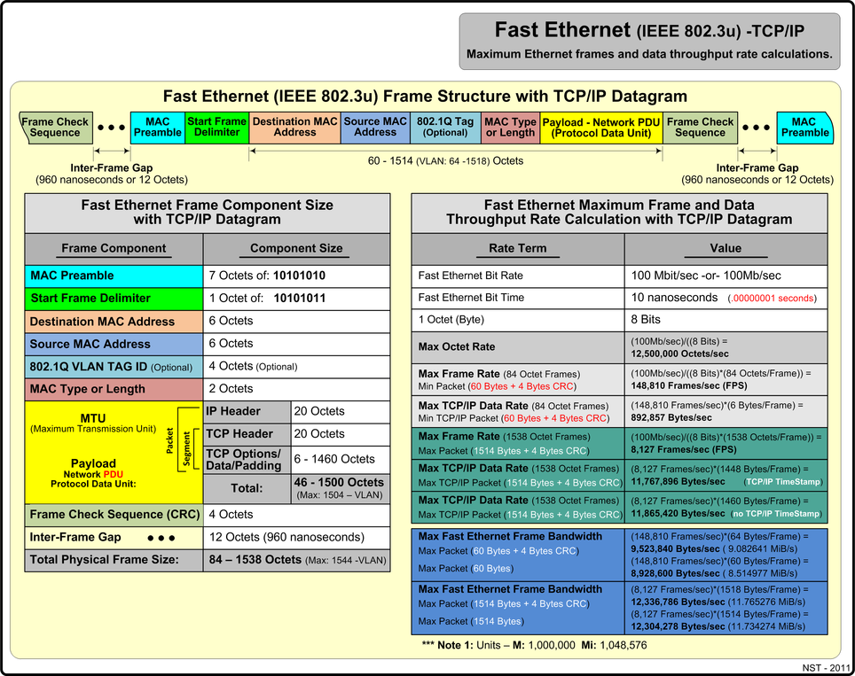
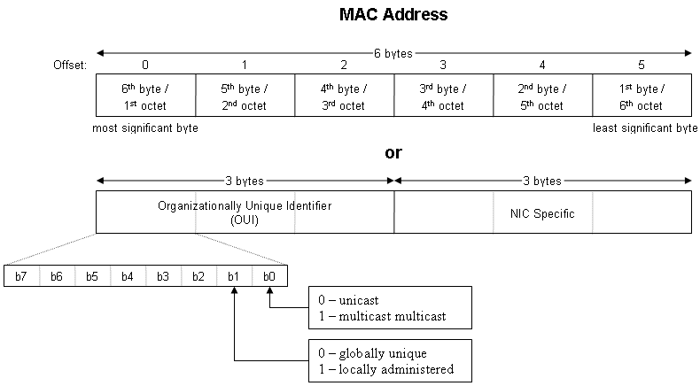

# IOS Commands
Grep like commands:
* begin 
* exclude
* include
* section

IE: 

`show running-config | include hostname`

## LAN's

### Need for switches

We used to basically use them as repeaters / capable extenders at one point, not really needed anymore.

Nowadays more useful for just connecting PC's to a single LAN

### What switches do
Functions:

* Three F's
    * Forward
    * Filter
    * Flood
* Operate at link layer for TCP/IP 
*  _selectively_ forward frames
* Many ports to segment large LAN into smaller ones
* Have various support speeds

### Characteristics

Half Duplex:
> Only one communication allowed at a time

Full Duplex:
> Back and forth traffic at the same time allowed.

Import characteristics:
* High Port density
* Large frame buffer
* Port Speeds
    * Capable of supporting multiple bandwidths 1G, 10G, etc
* Fast internal switching
    * Allows higher bandwidth
* Low per-port cost

## Exploring TCP/IP

### Ethernet LAN Connection

#### Mechanical properties

Physical Mediums:
* Coaxial 
    * single wire cobber, half duplex
* Twisted pair copper
    * Full duplex, twisted pairs
        * Color coded solid color w/ stripe
        * RJ45 crimp
    * 10 Mbps to 40 Gbps
    * Length
        * 30m to 100m depending on speed/cable/etc.
    * Types
        
        * Straight
            * Switch to anything else but another switch
        * Crossover
            * When connecting to the same type of device (including router to pc)
    * Cheap
    * Notes: auto-mdix is a thing, basically automagically handles straight-through as a crossover when needed.
* Fiber optics
    * Half or Full duplex in sense of single
    * Physical
        * Core
        * Cladding
        * Buffer / Coating
    * Connector types 

#### SFP(+) Connectors
Hot pluggable, can have many different connectors

### Ethernet Frame Structure

Preamble and Start frame delimiter are usually shown as one component.

Preamble & Start Frame Delimiter: Alternating 1's and 0's, used mostly for half-duplexes to signal that someone is ready to speak.

### LAN Communication Types
* Unicast
* Broadcast
* Multicast

### Mac Addresses

Delimiter can be `.`, `:`, or `-`.

* `.`
    * Often used for at routers
* `:`
    * Used in Unix style
* `-`
    * Windows usage

### Frame Switching

Basically:
1. Receives packet
2. Checks packet for where it should go
3. Checks MAC Address table for said address
4. If address is in MAC table
    1. `True:` Forward packet to device (except the one it came in on)
    2. `False:` Send packet everywhere available and hope someone responds
        * If no response, dead end
        * If response found, forwards packet
