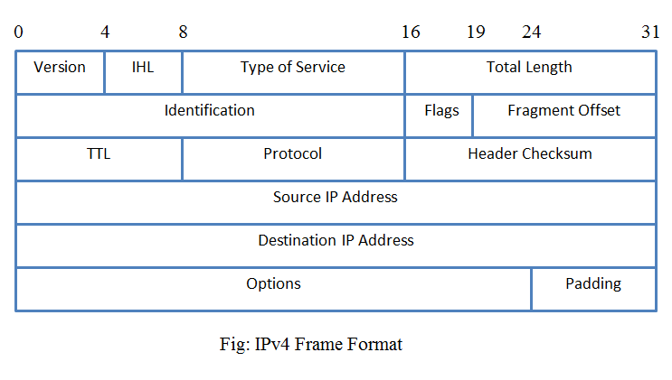
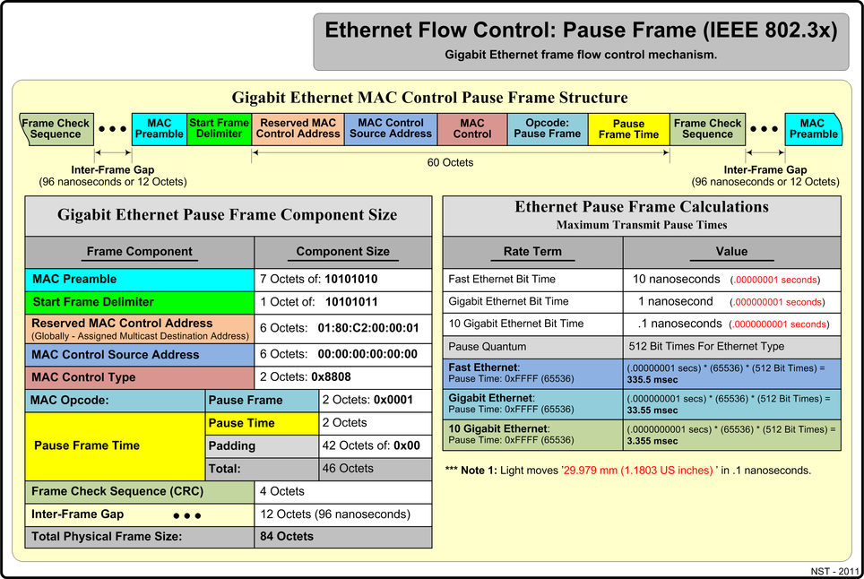
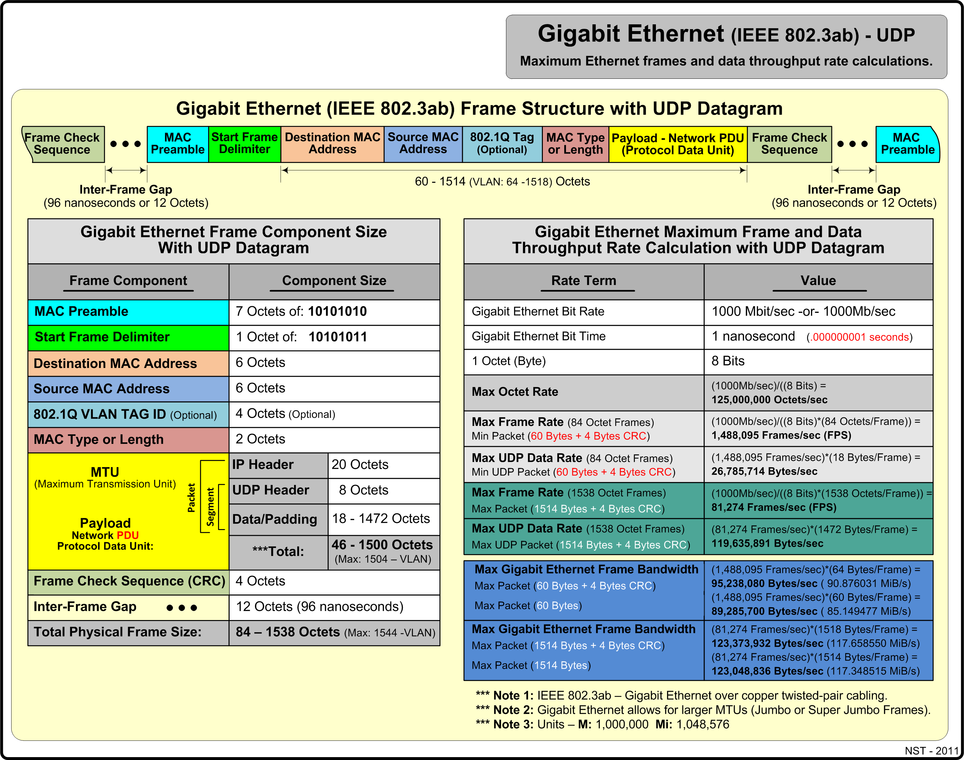
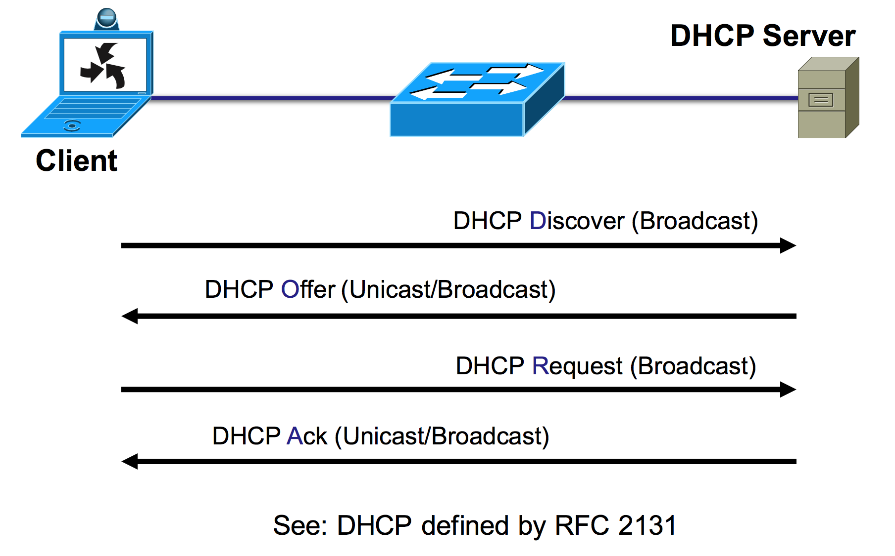

## Duplex Communications
### Half duplex

#### Characteristics

* Unidirectional flow
* Legacy connectivity*
    * Still used by some sensitive equipment: MRI machines, industrial printers, etc.
* Collisions may be an issue

### Full Duplex
#### Characteristics
* Point to point only
* Attached to dedicated switched port
* Requires full duplex on both ends*
    * A half to full duplex can work, but doesn't work well

### IOS Duplex Command
```sh
SwitchX# config

SwitchX (config)# interface fa0/1
SwitchX (config)# duplex full
SwitchX (config)# speed 100

SwitchX (config)# interface fa0/3
SwitchX (config)# duplex half
SwitchX (config)# speed 100

SwitchX (config)# interface fa0/5
SwitchX (config)# duplex auto
SwitchX (config)# speed auto
```

If you're hardcoding speed or duplex auto-mdx may not work properly, so be aware of it.

## Starting a Switch

### Switch Installation
* Verify requirements are met.
* Install the switch (rack/wall/table)
* Verify cabling
    * Used ports and console ports
* Attach power cable
* Observe POST test

### Switch LED Indicators
Not super reliable, lights burn out sometimes, sometimes they just burn into different colors despite everything being fine.  Decent for just kind of a glancing overview.

### Basic show commands and information

Most used command:
```sh
SwitchX# show interfaces FastEthernet 0/1  
FastEthernet0/1 is up, line protocol is up (connected)  
Hardware is Fast Ethernet, address is 001e.147c.bd01 (bia 001e.147c.bd01)  
MTU 1500 bytes, BW 100000 Kbit/sec, DLY 100 usec,  
reliability 255/255, txload 1/255, rxload 1/255  
Encapsulation ARPA, loopback not set  
Keepalive set (10 sec)  
Full-duplex, 100Mb/s, media type is 10/100BaseTX  
input flow-control is off, output flow-control is unsupported  
ARP type: ARPA, ARP Timeout 04:00:00  
Last input 00:00:00, output 00:00:00, output hang never  
Last clearing of "show interface" counters never  
Input queue: 0/75/0/0 (size/max/drops/flushes); Total output drops: 0  
Queueing strategy: fifo  
Output queue: 0/40 (size/max)
```

#### Show version command
```sh
SwitchX# show version  
Cisco IOS Software, C2960 Software (C2960-LANBASEK9-M), Version 15.0(1)SE3,
RELEASE SOFTWARE (fc1)  
Technical Support: http://www.cisco.com/techsupport  
Copyright (c) 1986-2012 by Cisco Systems, Inc.  
Compiled Wed 30-May-12 14:26 by prod_rel_team  
ROM: Bootstrap program is C2960 boot loader  
BOOTLDR: C2960 Boot Loader (C2960-HBOOT-M) Version 12.2(44)SE6, RELEASE
SOFTWARE (fc1)  
SwitchX uptime is 15 hours, 30 minutes  
System returned to ROM by power-on  
System restarted at 15:06:49 UTC Tue Aug 21 2012  
System image file is
"flash:/c2960-lanbasek9-mz.150-1.SE3/c2960-lanbasek9-mz.150-1.SE3.bin"
```

#### Other commands
```sh
SwitchX# show running-config  
Building configuration...  
  
Current configuration: 1750 bytes  
!  
! Last configuration change at 08:51:52 UTC Wed Aug 22 2012  
! NVRAM config last updated at 06:26:14 UTC Wed Aug 22 2012  
!  
version 15.0  
no service pad  
service timestamps debug datetime msec  
service timestamps log datetime msec  
no service password-encryption  
!
```

```sh
hostname SwitchX  
<... output omitted ...>  
interface FastEthernet0/1  
<... output omitted ...>  
interface Vlan1  
ip address 172.20.137.5 255.255.255.0  
!  
ip default-gateway 172.20.137.1  
<... output omitted ...>
```

# Introducing TCP/IP

## Internet Protocol
### Characteristics
* Operates at the internet layer
* Connectionless
* Each packet is independent
* IP Uses hierarchical addresses
* IP does not provide recovery of corrupted packets
* Independent of the medium that carries it.

## IPv4 Address Representation
Two parts:
16 bits of Network
16 bits of Host

## IPv4 Header Fields


## IPv4 Address Classes

Class A,B,C,D (not really used too often anymore, mostly just subnets)

Bitmask:

Class | 128 | 64  | 32  | 16  |  8  |  4  |  2  | 1 
  --- | --- | --- | --- | --- | --- | --- | --- | ---
A     | 1   |  x |  x |  x | x | x |  x | x |
B     | 1   |  1 |  x |  x | x | x |  x | x |
C     | 1   |  1 |  1 |  x | x | x |  x | x |


## Subnet Masks

My man skipped over this, gotta come back.

## Subnets
Flat topologies are a layer 2  can be problematic due to size and security of everything being on the same network.

Pros:
* Smaller networks are easier to troubleshoot
* Better utilization of IP Space
* Overall traffic is reduced
* Apply more network security policies

### Private ranges
* `10.0.0.0/8`
* `172.16.0.0/12`
* `192.168.0.0/16`

#### Loopbacks
* `127.0.0.1/8`
* 

### Subnet calculating

IP Address

#### Example 1

/        | IP(b1)  | IP(b2)  | IP(b3)  | IP(b4)  | Mask
---      | ---     | ---     | ---     | ---     | ---
Given    | 188     | 188     | 188     | 188     | 19
/        | 8       | 8       | 3       | 
Network  | 188     | 188     | 160     | 0
First    |
Last     |
Directed |
Next     |

/        | IP(b1)  | IP(b2)  | IP(b3)  | IP(b4)  | Mask
---      | ---     | ---     | ---     | ---     | ---
Given    | 200     | 78      | 78      | 104     | 27
Bitfield | 8       | 8       | 8       | 3       |
Network  | 200     | 78      | 78      | 96
First    |
Last     |
Directed |
Next     |

So for 3 ->

128 | 64  | 32  | 16  |  8  |  4  |  2  | 1 
--- | --- | --- | --- | --- | --- | --- | ---
1   | 1   |  1  | 0

224

#### Example 2

/        | IP(b1)  | IP(b2)  | IP(b3)  | IP(b4)  | Mask
---      | ---     | ---     | ---     | ---     | ---
Given    | 222     | 9       | 61      | 55      | 29
Bitfield | 8       | 8       | 8       | 5       |
Network  | 222     | 9       | 61      | 48
First    | 222     | 9       | 61      | 49
Last     | 222     | 9       | 61      | 54
Directed | 222     | 9       | 61      | 55
Next     | 222     | 9       | 61      | 56 

(56 comes from 8+ network state)

128 | 64  | 32  | 16  |  8  |  4  |  2  | 1 
--- | --- | --- | --- | --- | --- | --- | ---
1   | 1   |  1  | 1   |  1  | 0   | 0   | 0

55 -> 


128 | 64  | 32  | 16  |  8  |  4  |  2  | 1 
--- | --- | --- | --- | --- | --- | --- | ---
0   | 0   |  1  | 1   |  0  | 1   | 1   | 1

55-32 = 23
23 - 16 = 7
7 - 4 = 3
3 - 2 = 1
1 - 1 = 0


128 | 64  | 32  | 16  |  8  |  4  |  2  | 1   | Decimal
--- | --- | --- | --- | --- | --- | --- | --- |  ---
1   | 1   |  1  | 1   |  1  | 0   | 0   | 0   | 248
0   | 0   |  1  | 1   |  0  | 1   | 1   | 1   | 55
0   | 0   |  1  | 1   |  0  | 0   | 0   | 0   | 48


#### Example 3
/        | IP(b1)  | IP(b2)  | IP(b3)  | IP(b4)  | Mask
---      | ---     | ---     | ---     | ---     | ---
Given    | 140     | 14      | 84      | 100     | 27
Bitfield | 8       | 8       | 8       | 3       |
Network  | 140     | 14      | 84      | 96
First    | 140     | 14      | 84      | 97
Last     | 140     | 14      | 84      | 126
Directed | 140     | 14      | 84      | 127
Next     | 140     | 14      | 84      | 128

128 | 64  | 32  | 16  |  8  |  4  |  2  | 1   | Decimal
--- | --- | --- | --- | --- | --- | --- | --- |  ---
1   | 1   |  1  | 0   |  0  | 0   | 0   | 0   | 224
0   | 1   |  1  | 0   |  0  | 1   | 0   | 0   | 100
0   | 1   |  1  | 0   |  0  | 0   | 0   | 0   | 96

#### How to

Given: `140.14.84.100/27`

Split into each byte

For each bitfield subtract the maximum you can from the Mask.

So if you have 27 then you can subtract 8 and put it in the first bitfield (b1).

Then you have (27-8)=19

Repeat 

    (19-8) > 0, so b2 = 8.
    (19-8) = 11

Repeat

    (11-8) > 0, so b3 = 8
    (11-8) = 3

Repeat

    (3-8) < 0, so since it's less than 8 we use it.  b4 = 3

Now with all the `8`'s we can just copy their number, we only need to do math on the final.

So we have `140.14.84.x` atm to get the first

So to calculate the remainder we use the number of bits in our last entry (b4), then
we calculate that byte into it's decimal format (`0b11100000` = `0d224`)

128 | 64  | 32  | 16  |  8  |  4  |  2  | 1   | Decimal
--- | --- | --- | --- | --- | --- | --- | --- |  ---
1   | 1   |  1  | 0   |  0  | 0   | 0   | 0   | 224

Then we calculate the bytes of our given address (same as the bitfield):

(`0d100` = `0b01100100`)

128 | 64  | 32  | 16  |  8  |  4  |  2  | 1   | Decimal
--- | --- | --- | --- | --- | --- | --- | --- |  ---
0   | 1   |  1  | 0   |  0  | 1   | 0   | 0   | 100

Then we take these two and perform a logical AND on then (and convert the byte to decimal).

128 | 64  | 32  | 16  |  8  |  4  |  2  | 1   | Decimal
--- | --- | --- | --- | --- | --- | --- | --- |  ---
1   | 1   |  1  | 0   |  0  | 0   | 0   | 0   | 224
0   | 1   |  1  | 0   |  0  | 1   | 0   | 0   | 100
|
0   | 1   |  1  | 0   |  0  | 0   | 0   | 0   | 96

So now we know out network can start at `96`.

So our network starts at `140.14.84.96`

Then we can calculate where our next network begins by just taking the last active bit of our mask (for us in field `b4` which was `3`), which is of value `32`.  Then add that to the network
`96 + 32` is `140.14.84.128`.  So if that's where our next network starts then our network must end at one less `140.14.84.127`.  Which will also be our `Broadcast address`.

Which means we have all our info (`directed`=`broadcast` and `network`=`gateway`):

/        | IP(b1)  | IP(b2)  | IP(b3)  | IP(b4)  | Mask
---      | ---     | ---     | ---     | ---     | ---
Given    | 140     | 14      | 84      | 100     | 27
Bitfield | 8       | 8       | 8       | 3       |
Network  | 140     | 14      | 84      | 96
First    | 140     | 14      | 84      | 97
Last     | 140     | 14      | 84      | 126
Directed | 140     | 14      | 84      | 127
Next     | 140     | 14      | 84      | 128

#### Another how to

Given: `140.14.84.100/27`

Split into each byte

For each bitfield subtract the maximum you can from the Mask.

So if you have 27 then you can subtract 8 and put it in the first bitfield (b1).

Then you have (27-8)=19

Repeat 

    (19-8) > 0, so b2 = 8.
    (19-8) = 11

Repeat

    (11-8) > 0, so b3 = 8
    (11-8) = 3

Repeat

    (3-8) < 0, so since it's less than 8 we use it.  b4 = 3

Now with all the `8`'s we can just copy their number, we only need to do math on the final.

So we have `140.14.84.x` atm to get the first

So to calculate the remainder we use the number of bits in our last entry (b4), then
we calculate that byte into it's decimal format (`0b11100000` = `0d224`)

128 | 64  | 32  | 16  |  8  |  4  |  2  | 1   | Decimal
--- | --- | --- | --- | --- | --- | --- | --- |  ---
1   | 1   |  1  | 0   |  0  | 0   | 0   | 0   | 224

From this we can see our smallest "flipped on" bit is `32` which means all of our networks
are going to be on a 32'th increment.

We were given `140.14.84.100` which looking at our last byte we're looking for a value of 100.

So if we increment by our increment again and again we get:

* 0
* 32
* 64
* 96
* 128
* ...

We know that `100` is between `96` and `128` so that means it's also the range of our network.

So now we now know that network starts at `96` and ends at `128`

So our network starts at `140.14.84.96` and ends at `140.14.84.96` which means we have all our data needed.

(`directed`=`broadcast` and `network`=`gateway`):

/        | IP(b1)  | IP(b2)  | IP(b3)  | IP(b4)  | Mask
---      | ---     | ---     | ---     | ---     | ---
Given    | 140     | 14      | 84      | 100     | 27
Bitfield | 8       | 8       | 8       | 3       |
Network  | 140     | 14      | 84      | 96
First    | 140     | 14      | 84      | 97
Last     | 140     | 14      | 84      | 126
Directed | 140     | 14      | 84      | 127
Next     | 140     | 14      | 84      | 128


## Explaining the TCP/IP Transport Layer (& Application Layer)

Session Multiplexing:
> Basically just allow multiple connections by using multiple ports

### TCP Characteristics

TCP:
 * Connection Oriented
    * Syn -> Syn-Ack -> Ack -> Established
 * Handshake
 * Sequenced
 * Confirmation
 * Auto recovers 



### UDP Characteristics

UDP: 
 * Connectionless
 * Not sequenced
 * No handshake
 * No confirmation
 * Spray n pray
 * No recovery, at best says corrupted header
 * best effort :tm:



### Common services to know

```yaml
FTP:
    Port: 21
    Type: TCP
SSH:
    Port: 22
    Type: TCP
Telnet:
    Port: 23
    Type: TCP
HTTP:
    Port: 80
    Type: TCP
HTTPS:
    Port: 443
    Type: TCP
DNS:
    Port: 53
    Type: TCP/UDP # UDP for clients, TCP for between servers
TFTP:
    Port: 69
    Type: UDP
SNMP:
    Port: 161
    Type: UDP
```

### HTTP
http requests mostly over tcp using `GET`/`POST`/`PUT`/`PATCH`

### DNS
Contact lookup, human names to IP's

### DHCP (IPv4)
Dynamically assigns IP Addresses

#### Handshake (DORA)
1. DHCP Discover from client
2. DHCP Offer from Server
3. DHCP Request from Client
4. DHCP ACK From Server

Runs as a broadcast to inform everyone (also because it has no way to directly contact yet).



##### Configure router to get an IP via DHCP
```sh
Router# show ip interface brief  
Interface IP-Address OK? Method Status Protocol  
GigabitEthernet0/0 192.168.1.10 YES DHCP up up  
GigabitEthernet0/1 10.1.1.1 YES NVRAM up up
```

##### Configure a router to use DHCP Server
(DHCP Relay)
```sh
Router(config)# interface GigabitEthernet0/1  
Router(config-if)# ip helper-address 10.0.0.1
```
`ip helper-address` is only supposed to really convert broadcasts to a unicast

Only needs to be setup on the first hop, then it's just normal unicast instead of broadcasting.

##### Configure a router as a DHCP Server

(In the below the pool name is the same as the VLAN name, generally just a unique name)
```sh
Router(config)# ip dhcp excluded-address 10.1.50.1 10.1.50.50  
Router(config)# ip dhcp pool Customer  
Router(dhcp-config)# network 10.1.50.0 /24  
Router(dhcp-config)# default-router 10.1.50.1  
Router(dhcp-config)# dns-server 10.1.50.1  
Router(dhcp-config)# domain-name cisco.com  
Router(dhcp-config)# lease 0 12  
Router(dhcp-config)# exit
```

#### Windows DHCP
ipconfig /\<opt\>

opts:
* all
* renew
* release
* displaydns
* flushdns