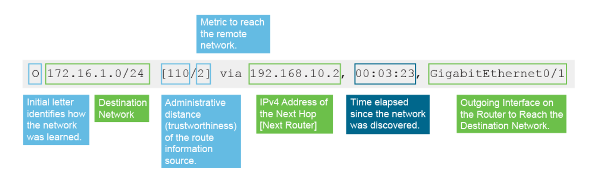

# Exploring the functions of routing

## Role of a router

* Routers are required to reach hosts that are not in the local network
* Routers use a routing table to route between networks

How to count collision domains:
> Just count the number of links on the networks

Broadcast Domain:
> A count of sub networks that can be broadcasted to
* If two routers connect make sure **not** to count the domain twice

## Router components

* CPU
* Motherboard
    * RAM
    * NVRAM
    * ROM
    * FLASH
* Ports
    * Management
        * Serial
        * Auxiliary (out of band dial in)
        * IP Management (Standard RJ45 network)
    * Network
    * Modular swap ins (can be whatever)

### ISR Router
Integrated Services Router

    Capable of doing QoS, management, etc.

### ASR Router
Aggregate Services Router

    Carrier / ISP grade

## Router functions

Two main functions
* Path determination
* Packet forwarding

## Routing Table

### Directly connected networks


### Dynamic Routes


### Static


### Default Route


Catch all

```sh
RouterA# show ip route  
Codes: L - local, C - connected, S - static, R - RIP, M - mobile, B - BGP  
D - EIGRP, EX - EIGRP external, O - OSPF, IA - OSPF inter area  
N1 - OSPF NSSA external type 1, N2 - OSPF NSSA external type 2  
E1 - OSPF external type 1, E2 - OSPF external type 2  
i - IS-IS, su - IS-IS summary, L1 - IS-IS level-1, L2 - IS-IS level-2  
ia - IS-IS inter area, * - candidate default, U - per-user static route  
o - ODR, P - periodic downloaded static route, + - replicated route  
  
Gateway of last resort is 10.1.1.1 to network 0.0.0.0  
  
C 10.1.1.0/24 is directly connected, GigabitEthernet0/0  
L 10.1.1.2/32 is directly connected, GigabitEthernet0/0  
R 172.16.0.0/16 [120/1] via 192.168.10.2, 00:01:08, GigabitEthernet0/1  
O 172.16.1.0/24 [110/2] via 192.168.10.2, 00:03:23, GigabitEthernet0/1  
D 192.168.20.0/24 [90/156160] via 10.1.1.1, 00:01:23, GigabitEthernet0/0  
S 192.168.30.0/24 [1/0] via 192.168.10.2  
C 192.168.10.0/24 is directly connected, GigabitEthernet0/1  
L 192.168.10.1/32 is directly connected, GigabitEthernet0/1  
S* 0.0.0.0/0 [1/0] via 10.1.1.1
```

Legend:
  * C: Indicates directly connected networks; the first and seventh entries are directly connected networks. 
  * L: Indicates local interfaces within connected networks; the second and eighth entries are local interfaces. 
  * R: Indicates RIP; the third entry is RIP route. 
  * O: Indicates OSPF; the fourth entry is an OSPF route. 
  * D: Indicates EIGRP; the fifth entry is an EIGRP route. The letter D stands for Diffusing Update Algorithm (DUAL), which is the update algorithm that EIGRP uses. The code letter E was previously taken by the legacy exterior gateway protocol (EGP). 
  * S: Indicates static routes; the sixth and ninth entries are static routes. 
  * Asterisk (*): Indicates that this static route is a candidate for the default route. 

## Path Determination

Routing algorithms:
* RIP
    * Uses hop count to determine where to send traffic
* EIGRP
    * Does some calculations
        * IE: 
            * A link on 100 Mbps costs 10 points
            * A link on 1 Gbps costs 1
        * Chooses lowest cost.
            * 12 hops on 1 Gbps is less preferable than 1 hop of 100 Mbps
* OSPF

### Administrative Table

These values are base trust

Route Source | Default Distance 
---          | ---
Connected    | 0
Static       | 1
EIGRP        | 90
OSPF         | 110
RIP          | 120

Winner determined by administrative distance and that's what's added to the routing table.

### Determing route to use

Checks the longest string of matching bits of the IP to the route (this ends up being the most specific path).

IE:

`10.1.1.1`
->

`10.0.0.0/8`

`10.1.1.0/16`

`10.1.1.1/32`

`0.0.0.0/0` # Default route, if we get here just send it.

# Configuring a Cisco Router

If a router doesn't have a system config in NVRAM it'll oot up and ask to use the configuration wizard.  It can also be accessed with the `setup` command.
Generally a lot of people just say `no` and skip it then continue to configure it.

## Configuring IPv4 Addresses
```sh
RouterX# configure terminal  
RouterX(config)# interface GigabitEthernet 0/0  
RouterX(config-if)# no shutdown  
%LINK-3-UPDOWN: Interface GigabitEthernet0/0, changed state to up  
%LINEPROTO-5-UPDOWN: Line protocol on Interface GigabitEthernet0/0, changed
state to up
RouterX(config)# interface Serial 0/0/0  
RouterX(config-if)# shutdown  
%LINK-5-CHANGED: Interface Serial0/0/0, changed state to administratively down  
%LINEPROTO-5-UPDOWN: Line protocol on Interface Serial0/0/0, changed state to
down
```

```sh
RouterX# configure terminal  
RouterX(config)# interface Serial 0/0/0  
RouterX(config-if)# ip address 172.18.0.1 255.255.0.0  
RouterX(config-if)# no shutdown
```

## Checking Interface configuration and Status

### Troubleshooting Status Codes

Hardware and Line Protocol Status | Typical Reasons
---                               | ---
Administratively down, down       | The interface has been shutdown via a command
down, down                        | The interface has `no shutdown` command that is configured, but the link has problems (bad cable, not connected, powered off, etc.)
up, down                          | Almost always data link problems (wrong protocol?)
up, up                            | All is well and functioning

Check the other side and make sure it's not administratively down, otherwise just try reseating and replacing the cable.

`down, up` occurred in X25 networks where it understood the bits, but failed to get enough to consider itself up.  Doesn't really happen anymore.

## Exploring Connected Devices

### Link Layer Discover Protocol (LLDP)

Used to automatically discover things to create information, usually turned off in enterprise for security reasons.

#### Cisco Discovery Protocol (CDP)

Cisco specific LLDP Implementation only works for Cisco devices (for the CCNA exam), but technically can work with some other vendors.

### Information Discovered
* Device Identifiers 
    * IE: hostname
* Address List 
    * Up to one network layer address for each protocol
* Port Identifier
    * The identifier of the local port
* Capabilities list
    * Supported features
* Platform
    * Device ID, IE: Cisco 4000

## Using Cisco Discovery Protocol

```sh
RouterA# show cdp ?  
entry Information for specific neighbor entry  
interface CDP interface status and configuration  
neighbors CDP neighbor entries  
traffic CDP statistics
```
```sh
RouterA(config)# no cdp run  
! Disable CDP Globally  
RouterA(config)# interface serial0/0/0  
RouterA(config-if)# no cdp enable  
! Disable CDP on just this interface
```
```sh
RouterA# show cdp neighbors  
Capability Codes: R - Router, T - Trans Bridge, B - Source Route Bridge  
S - Switch, H - Host, I - IGMP, r - Repeater  
Device ID Local Intrfce Holdtme Capability Platform Port ID  
SwitchA fa0/0 122 S I WS-C2960 fa0/2  
RouterB s0/0/0 177 R S I 2811 s0/0/1
```
```sh
RouterA# show cdp neighbors detail  
Device ID: RouterB  
Entry address(es):  
IP address: 10.1.1.2  
Platform: Cisco 2811, Capabilities: Router Switch IGMP  
Interface: Serial0/0/0, Port ID (outgoing port): Serial0/0/1  
Holdtime : 155 sec  
Version :  
Cisco IOS Software, 2800 Software (C2800NM-ADVIPSERVICESK9-M), Version
12.4(12), RELEASE  
SOFTWARE (fc1)  
Technical Support: http://www.cisco.com/techsupport  
Copyright (c) 1986-2006 by Cisco Systems, Inc.  
Compiled Fri 17-Nov-06 12:02 by prod_rel_team
```

## Configure and Verify LLDP
```sh
R1(config-if)# [no] lldp run
R1(config-if)# [no] lldp transmit  
R1(config-if)# [no] lldp receive
R1# show lldp neighbors
R1# show lldp neighbors  
Capability codes:  
(R) Router, (B) Bridge, (T) Telephone, (C) DOCSIS Cable Device  
(W) WLAN Access Point, (P) Repeater, (S) Station, (O) Other  
  
Device ID Local Intf Hold-time Capability Port ID  
DSW2 Et0/2 120 R Et0/2  
DSW1 Et0/1 120 R Et0/2  
  
Total entries displayed: 2
```

