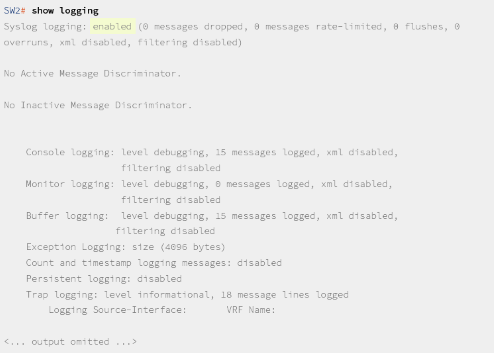
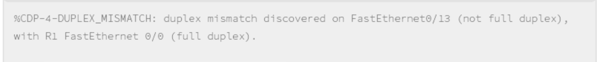
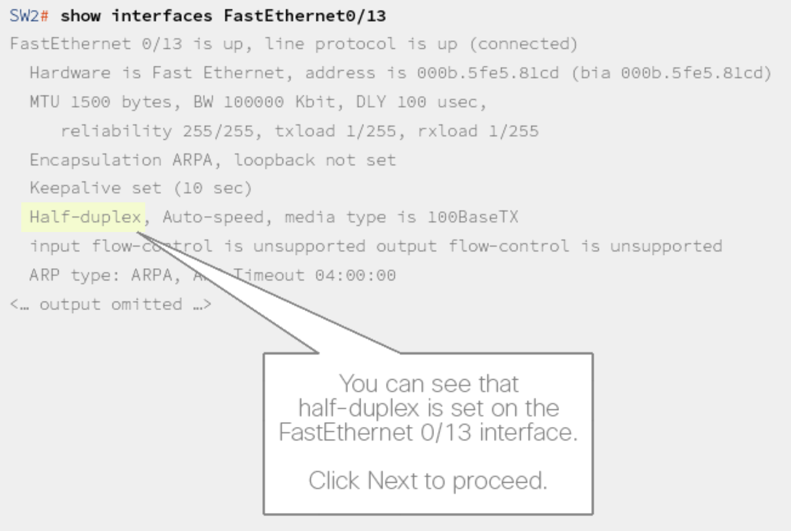
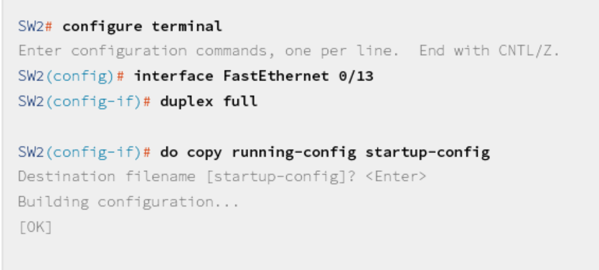

# Troubleshoot Port Duplex Issues

    Your colleague informs you that SW2 is showing messages about a duplex
    mismatch and that they are unable to prevent the messages. The senior
    engineers went out for lunch and you need to resolve this issue on your own.

Due to how this lab works I only can screenshot things, can't run any commands myself.
> In this activity, you will interact with a recording of a lab, made on actual
devices, rather than with the actual devices. In this activity, when entering
a command, the entire command must be entered exactly as stated, including
matching the case and spaces; shortcuts and tab completion are not supported.
In GUIs, you will only be able to use the menu items required for the
activity, you will not be able to use other menu items.

## Enable logging

## Check the interface

The link appears to be up and functional, but it's at half duplex.

## Configure the interface to be full

## Notes

Easily the most useless lab I've ever seen.  We turn on logging, see it's half-duplex, assume that's the issue, change it to full, then walk away.  We don't even verify if it works.  I don't know why a colleague would ask you to change things when change device states like this is trivial.