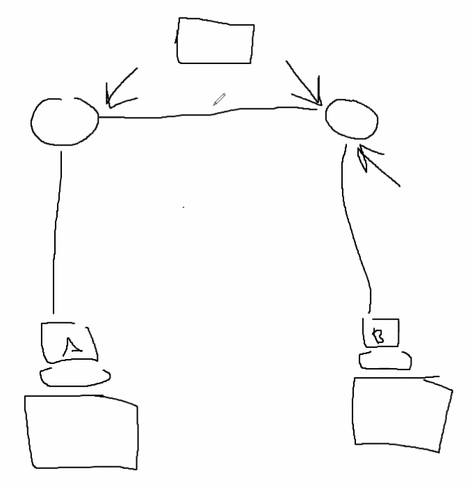

# Somemore subnet math

## Example 1
/        | IP(b1)  | IP(b2)  | IP(b3)  | IP(b4)  | Mask
---      | ---     | ---     | ---     | ---     | ---
Given    | 180     | 80      | 160     | 165     | 17
Bitfield | 8       | 8       | 1       | x       |
Network  | 180     | 80      | 160      | 165    
First    | 180     | 80      | 160      | 166   
Last     | 180     | 80      | 255      | 254       
Directed | 180     | 80      | 255      | 255     
Next     | 180     | 81      | 0      | 0

128 | 64  | 32  | 16  |  8  |  4  |  2  | 1   | Decimal
--- | --- | --- | --- | --- | --- | --- | --- |  ---
1   | 0   |  0  | 0   |  0  | 0   | 0   | 0   | 128
1   | 0   |  1  | 0   |  0  | 1   | 0   | 1   | 165
1   | 0   |  0  | 0   |  0  | 0   | 0   | 0   | 128

## Example 2
/        | IP(b1)  | IP(b2)  | IP(b3)  | IP(b4)  | Mask
---      | ---     | ---     | ---     | ---     | ---
Given    | 131     | 25      | 35      | 129     | 19
Bitfield | 8       | 8       | 3       | x       |
Network  | 131     | 25      | 32      | 0     
First    | 131     | 25      | 32      | 1  
Last     | 131     | 25      | 63      | 254
Directed | 131     | 25      | 63      | 255
Next     | 131     | 25      | 64      | 0     

## Example 3 (some actual subnetting)

Network:
> Always a classful boundary

Subnet:
> Not a classful boundary

VLSM:
> Subnetting a subnet

Split `172.16.32.0/19` into 3 subnets of size `50`

Find the number 2 after the mask.

`19 + 19 + 19 = 57` -> `64`

128 | 64  | 32  | 16  |  8  |  4  |  2  | 1   | Decimal
--- | --- | --- | --- | --- | --- | --- | --- |  ---
1   | 1   |  0  | 0   |  0  | 0   | 0   | 0   | 

Smallest value is `64` so use it to increment

Lan 1: `172.16.32.0/26`

Lan 2: `172.16.32.64/26`

Lan 3: `172.16.32.128/26`

Calculating WAN:

Starting Block: `172.16.32.192/26`

Get the inverse

128 | 64  | 32  | 16  |  8  |  4  |  2  | 1   | Decimal
--- | --- | --- | --- | --- | --- | --- | --- |  ---
1   | 1   |  1  | 1   |  1  | 1   | 0   | 0   | 

WAN 1: `172.16.32.192/30`

WAN 2: `172.16.32.196/30`

WAN 3: `172.16.32.200/30`

`/31` is the most efficient address space because you use 100%.

You get 2 IP's and get both the gateway and broadcast (Usually the WAN)

## Example 4 (some actual subnetting)

Split `10.0.0.0/19` into 3 subnets

3 Address spaces sizes:

`3000`, `4000`, `2950`

Counted up by doubling on each, and we found that 4096  captures the 4000

128 | 64  | 32  | 16 (4096)  |  8 (2048) |  4 (1024)  |  2 (512)  | 1 (256)   | ___ | 128 | 64  | 32  | 16  |  8  |  4  |  2  | 1   | Decimal
--- | --- | --- | --- | --- | --- | --- | --- |  --- | --- | --- | --- | --- | --- | --- | --- | --- |  ---
1   | 1   |  1  | 0   |  0  | 0   | 0   | 0   | ___ | 0   | 0   |  0  | 0   |  0  | 0   | 0   | 0   | 57344

`128 * 32` = 4096 

`128 * 24` = 3072

`128 * 24` = 3072

So, none of those are smaller than the last value (2048), so we'll just use `4096` of all of them.

`10.0.0.0/20`

`10.0.16.0/20`

`10.0.32.0/20`

WAN starting block: `10.0.48.0/20`

Need 3 IP's so turn on all but the 2 bit

128 (32768) | 64 (16384)  | 32 (8192)  | 16 (4096)  |  8 (2048) |  4 (1024)  |  2 (512)  | 1 (256)   | ___ | 128 | 64  | 32  | 16  |  8  |  4  |  2  | 1   | Decimal
--- | --- | --- | --- | --- | --- | --- | --- |  --- | --- | --- | --- | --- | --- | --- | --- | --- |  ---
1   | 1   |  1  | 1   |  1  | 1   | 1   | 1   | ___ | 1   | 1   |  1  | 1   |  1  | 1   | 0   | 0   | 65532 (`(2^16 - 1) - 2 - 1`)

WAN 1: `10.0.48.0/30`

WAN 2: `10.0.48.4/30`

WAN 3: `10.0.48.8/30`

## Example 5 (split into all available)
/        | IP(b1)  | IP(b2)  | IP(b3)  | IP(b4)  | Mask
---      | ---     | ---     | ---     | ---     | ---
Given    | 10      | 10      | 10      | 0       | 24
Bitfield | 8       | 8       | 8       | x       | 

So we borrowed `16` bits from hosts for subnetting (first 2 bytes, and we start on byte 1 already given to us).

Looking at some more maybe go look at www.subnettingquestions.com

## Example 6 (Exam like question)

Given this network diagram, Host A cannot ping Host B, what is the issue?

What to look for:
* Check their IP's and subnets, check if they're in different subnets

# After lunch problems

`10.0.0.0/8`

3 subnets 100 IP's each

`128` is the first larger than 100.

128 | 64  | 32  | 16  |  8  |  4  |  2  | 1   | Decimal
--- | --- | --- | --- | --- | --- | --- | --- |  ---
1   | 0   |  0  | 0   |  0  | 0   | 0   | 0   | 128

Subnets have a rule where it needs to be continuous 1's left to right with no gaps.

`8` comes from using the full 8 bits (from using `128`), if you only needed say `32` per you'd just use `6`.  Then 3 subnets + 1 subnet for WANs
Mask is `(8*3)+1`

LAN 1: `10.0.0.0/25`
LAN 2: `10.0.0.128/25`
LAN 3: `10.0.1.0/25`

WAN's starting: `10.0.1.128/25` (VLSM?)

Taking 2 digits larger than 2 to get that many extra 

WAN 1: `10.0.1.128/30`
WAN 2: `10.0.1.132/30`
WAN 3: `10.0.1.136/30`
