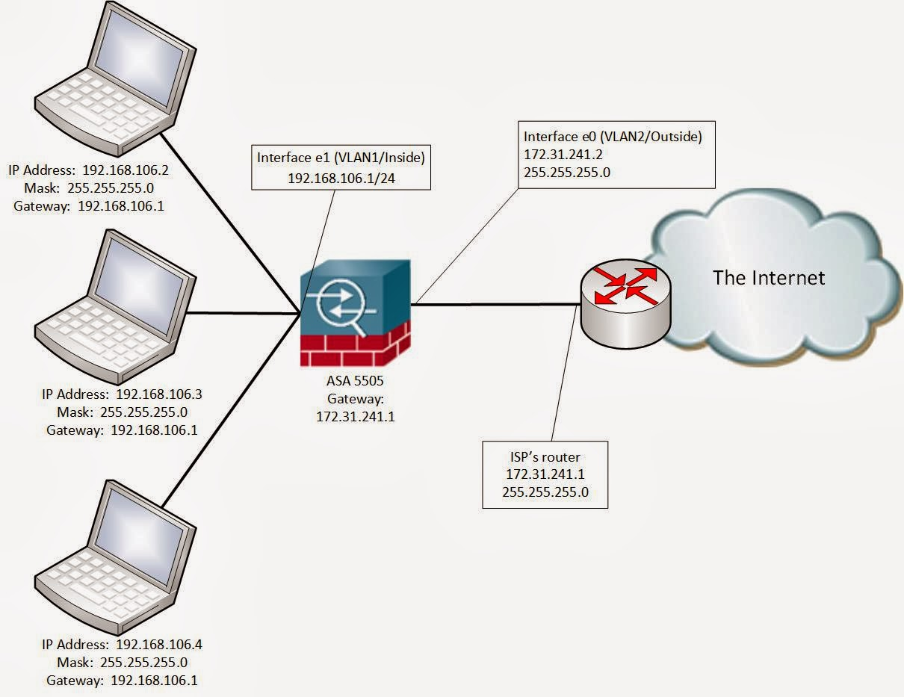

# Exploring the Packet Delivery Process

## Layer 2 Addressing

## Layer 3 Addressing

## Default gateways
Default Gateway:
> The "last resort" gateway which is where you send traffic that is not in your network to escape up to the next gateway.



## Address Resolution Protocol (ARP)

ARP is only capable of searching for hosts within your subnet.

Example Message:
```
Source Destination Prot Info  
00:bc:22:52:e8:bd Broadcast ARP Who has 10.10.1.175? Tell 10.10.1.241  
  
Source Destination Prot Info  
00:bc:22:a8:e0:a0 00:bc:22:52:e8:bd ARP 10.10.1.175 is at 00:bc:22:a8:e0:a0
```

## Host to Host Packet Delivery

TODO: Go back to this later, apparently too hard to present? Sure

