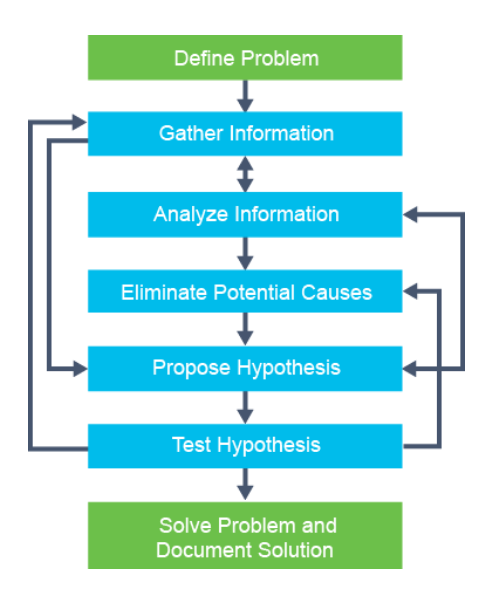

# Troubleshooting a simple network

## Troubleshooting methods

Suggested Flow:



Eliminating potential causes is one of the key points

## Troubleshooting Tools

### Logging

* Basic log messages when connected to an IOS system
    * Shows by default to a true TTY
    * VTTY's like over SSH or Serial need to be enabled with `terminal monitor` and `show logging`.

### Other tools for IP connectivity
* `ping`
    * You can ping from a specific interface `ping $ip source $interface`
* `traceroute`
    * Like a ping packet but with incrementing TTL's, which causes a return from the device (which returns back in the IP SRC address).
    * `*`'s can be info from the control plane about rate limiting and/or acknowledgement of no response.
* `telnet` / `ssh`
* `show ip arp` / `show ip`


## Common switch media issues

* Damaged wires
* New EMI (electrical magnetic interference) introduced
* Traffic patterns changed
* New equipment installed
* Fiber specific
    * Dirty end connectors
    * Splice losses
    * Too much bend causing glass break/fracture
        * Bends should be greater than 25-30mm radius to prevent loss
    
## Media workflow issues
* Check interfaces
    * Could be any of the above
* check noise
    * Cable length?
    * Bandwidth issues?

## Switch port issues
Really common is port speed mismatch (`half`/`full`).
Even auto may not always work.

Check physical issues
* Did you actually plug it in?
    * No seriously
        * Seriously seriously
            * Yes go walk over there and check.

### Check interface drops / errors
```sh
show interfaces GigabitEthernet0/1
```
