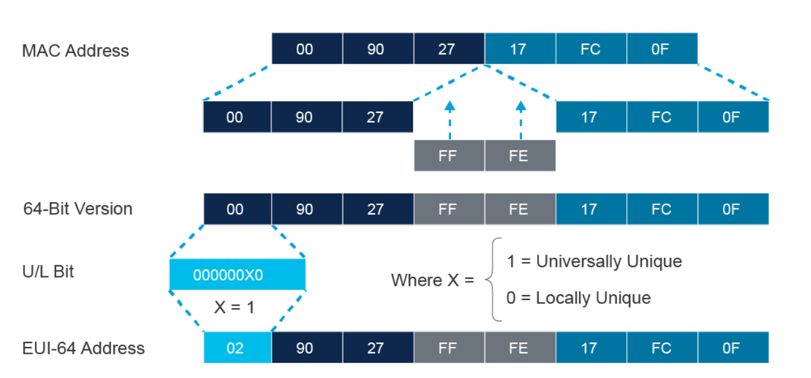
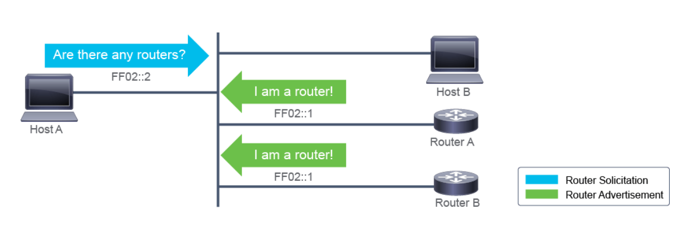

# Introducing IPv6

## IPv4 Exhaustion

Running out of space

### Hotfixes:
* NAT
* Variable-Length subnet masking (VLSM)
* Classless interdomain routing (CIDR)
* Private IP spaces (RFC 1918)

### Issues
* NAT breaks end to end model
* Inhibits some network security
* Some applications aren't NAT friendly
* Merging of networks can be difficult due to IP overlap.

## IPv6 Features

* Larger Address Space
* Simple Header
* Security and mobility? (what?)
* Transition richness

## IPv6 Addresses and Types

* 128 bits formatted as 16 bit hexadecimal fields.
* Case insensitive
* Leading zeros can be ommitted
* Successive fields of 0's can be represented by nothing, IE: `::`

DAD: Duplicate address detection


### Types

* Unicast
* Multicast
* Broadcast
    * Not available in IPv6
* Anycast
    * Be able to give different machines the same IP.
    * Should automatically find the closest
    * Not really used in the real world, mostly just use DNS.

### EUI-64 format

48 bits worth of values can be mapped directly to MAC address, just `FFFE` according to IEEE
64 bits to the interface ID



## IPv6 Address Allocation

### Static
```sh
Router(config)# interface Ethernet0/0  
Router(config-if)# ipv6 address 2001:db8:2222:7272::72/64  
Router(config-if)# ipv6 address fe80::1 link-local
```

#### EUFI-64 Interface ID assignment
```sh
Router(config)# interface Ethernet0/0  
Router(config-if)# ipv6 address 2001:0db8:0:1::/64 eui-64
```

### Stateless Address Autoconfig (SLAAC)
Router gives you an IP and default gateway without DHCP, no lease time, no DNS servers, etc.  Very plug-n-play.




#### Configure on router for autoconfig

```sh
ipv6 address autoconfig [default]
```

### Stateful DHCPv6
Normal DHCP

### Stateless DHCPv6
DHCPv6 for devices without a handshake understanding 


## Verify End to End IPv6

* Ping
* Traceroute
* Telnet

```sh
netsh interface ipv6 show neighbors
show ipv6 neighbors
```

## Enable IPv6 routing
```sh
show running-config
ipv6 unicast routing
show ipv6 interface
```
If you don't enable this, many things just don't work.

### IPv6 usage

Example
`fc00:2715:3f:201b::/64`
`fc00` -> private IP
`2715` address, office number maybe (site)
`3f` 3rd floor, maybe vlan?
`201b` ruin

Make them useful to you, maybe don't use location data though, bit much.

## Exam specifics

* Able to identify a valid IPv6 address
* Address types (global, link, etc.)


#### notable

Address | Value | Description  
---|---|---  
Global Unicast | 2000::/3 | Assigned by Internet Assigned Numbers Authority (IANA) and used on public networks. They are equivalent to IPv4 global (public) addresses. ISPs summarize these to provide scalability on the internet.    
Link-local | fe80::/10 | An automatically configured IPv6 address on an interface, the scope is only on the physical link, and is required.  
Unique-Local | fc00::/7 | Unique local unicast addresses are analogous to private IPv4 addresses in that they are used for local communications. The scope is entire site or organization.

Scopes:
* Interface - Local
    * Automatically configured plug n play, no DHCP server required.
* Link - Local
* Site - Local
* Organization - Local


Previously had a Static/Business IP for my internet service at my address previously.  However, after replacing my router yesterday I noticed that I no longer have that public IP address and instead have an internal address.
I assume this is due to MAC assignment, can this please be updated?  
Thank You!

Address:
710 W Grand Ave
Unit 503

New MAC Address:  fc:34:97:a2:74:ef 

Current IP Address that needs to be replaced:
 10.14.145.83/22 