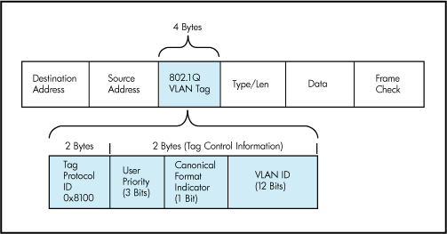

# Configuring Static Routing

## Routing Operation
* Identify Destination of the Packet
* Identify the source of routing information
* Identify Routes
* Select Routes
* Maintain and verify routing information

## Static and Dynamic Routing

* Static Route
    * Manually entered
    * Requires manual updates
    * Very precise
* Dynamic Routing
    * Network routing protocol automatically adjust routes based on topology or traffic
    * Learn and Maintain
    * Auto discovery and sharing of info

## When to use static routing
* Small network
* Hub and spoke topology
* when you want to create an ad hoc route
* common default statics

When not to:
* Large network
* Constantly expanding

## IPv4 static route config

```sh
ip route 172.16.1.0 255.255.255.0 172.16.2.1
ip route <ip> <mask> <gate>
```

### Default route
```
config 
ip route 0.0.0.0 0.0.0.0 172.16.2.2
```
Default routes are always suboptimal, but not a bad thing implicitly.

## Verifying Static and Default routes

```sh
RouterA# show ip route  
Codes: L - local, C - connected, S - static, R - RIP, M - mobile, B - BGP  
D - EIGRP, EX - EIGRP external, O - OSPF, IA - OSPF inter area  
N1 - OSPF NSSA external type 1, N2 - OSPF NSSA external type 2  
<... output omitted ...>  
Gateway of last resort is not set  
  
10.0.0.0/24 is subnetted, 1 subnets  
C 10.0.0.0 is directly connected, FastEthernet0/0  
172.16.0.0/24 is subnetted, 2 subnets  
S 172.16.1.0/24 [1/0] via 172.16.2.1  
C 172.16.2.0/24 is directly connected, Serial0/0/0  
L 172.16.2.2/32 is directly connected, Serial0/0/0
```

`S` static

`S*` last resort


Routes are all _prefix_ based, they match on the first bit, always.

## Configuring IPv6 static route

```sh
Router# configure terminal  
Router(config)# ipv6 unicast-routing  
Router(config)# ipv6 route 2001:0db8:beef::/32 fa1/0 fe80::2  
Router(config)# ipv6 route 2001:0db8:beef::/32 2001:0db8:feed::1
```

It does matter what type of address you're using for next hop.

# VLANs and Trunks

## VLAN Introduction

* A VLAN is a virtual LAN
* Layer 2 broadcast domain
* maps to a unique IP subnet (layer 3)
* Provides
    * Segmentation
    * Security
    * Network flexibility

## Creating a vlan

```sh
SwitchX# configure terminal  
SwitchX(config)# vlan 2  
SwitchX(config-vlan)# name Sales
```

**Exception Notice**:

    VLAN's are one of the few things that do not automatically apply upon hitting enter.  They only do once you end the vlan config.

### Assigning a port to a VLAN
Command and Variable | Membership Mode | VLAN Membership Characteristics  
---|---|---  
switchport mode access | Static-access | A static-access port can belong to one VLAN and is manually assigned to that VLAN.  
switchport mode trunk | Trunk (Institute of Electrical and Electronics Engineers [IEEE] 802.1Q) | A trunk port is a member of all VLANs by default, including extended-range VLANs, but membership can be limited by configuring the allowed-VLAN list.   
switchport voice vlan vlan-id | Voice VLAN | A voice VLAN port is an access port attached to a Cisco IP Phone, configured to use one VLAN for voice traffic and another VLAN for data traffic from a device attached to the phone.  


```sh
SwitchX# configure terminal  
SwitchX(config)# interface FastEthernet 0/3  
SwitchX(config-if)# switchport mode access  
SwitchX(config-if)# switchport access vlan 2
```

#### Add VLAN 3 and name it "telephony":

```sh
SW1# configure terminal  
SW1(config)# vlan 3  
SW1(config-vlan)# name telephony
```

#### Assign interface FastEthernet0/2 to voice VLAN 3:
```sh
SW1# configure terminal  
SW1(config)# interface FastEthernet0/2  
SW1(config-if)# switchport mode access  
SW1(config-if)# switchport voice vlan 3
```

### Verifing VLANs
```sh
SW1# show vlan  
  
VLAN Name                             Status                   Ports  
---- -------------------------------- ------------------------ ----------------  
1 default active Fa0/1, Fa0/3, Fa0/4, Fa0/5, Fa0/6, Fa0/7  
2 data active Fa0/2  
3 telephony active Fa0/2  
1002 fddi-default act/unsup  
1003 token-ring-default act/unsup  
1004 fddinet-default act/unsup  
1005 trnet-default act/unsup  
  
VLAN Type  SAID        MTU  Parent RingNo BridgeNo Stp  BrdgMode Trans1 Trans2  
---- ----- ---------- ----- ------ ------ -------- ---- -------- ------ ------  
1 enet 100001 1500 - - - - - 0 0  
2 enet 100002 1500 - - - - - 0 0  
3 enet 100003 1500 - - - - - 0 0  
1002 fddi 101002 1500 - - - - - 0 0  
1003 tr 101003 1500 - - - - - 0 0  
1004 fdnet 101004 1500 - - - ieee - 0 0  
1005 trnet 101005 1500 - - - ibm - 0 0  
  
Remote SPAN VLANs  
------------------------------------------------------------------------------  
  
  
Primary Secondary Type Ports  
------- --------- -----------------------------------------------------------  
```

Can also specify a specific vlan.
```sh
SW1# show vlan <vlan-id>
```

Switch Operations

Interface mode on one side | Interface mode on other side | Resulting operational mode  
---|---|---  
dynamic auto | dynamic auto | access  
dynamic auto | dynamic desirable | trunk  
dynamic desirable | dynamic desirable | trunk  
dynamic auto or dynamic desirable | trunk | trunk  
dynamic auto or dynamic desirable | access | access

#### Switchport data
```sh
SW1# show interfaces FastEthernet0/2 switchport  
Name: Fa0/2  
Switchport: Enabled  
Administrative Mode: dynamic desirable  
Operational Mode: static access  
Administrative Trunking Encapsulation: negotiate  
Operational Trunking Encapsulation: native  
Negotiation of Trunking: On  
Access Mode VLAN: 2 (data)  
Trunking Native Mode VLAN: 1 (default)  
Administrative Native VLAN tagging: enabled  
Voice VLAN: 3 (telephony)  
<... output omitted ...>
```

## Trunking with 802.1Q

Trunking allows multiple VLANs on one link, otherwise you'd need multiple links for each VLAN.

Each frame has a VLAN tag, that is applied by the switch on trunk ports (but not for direct links).



Off limit VLANs:

`0`: System Use
`1`: Default
`4094`: Weird VMWare thing, just avoid it.
`4095`: System use

## Configuring an 802.1Q Trunk

Traffic from VLAN 99 is sent untagged
```sh
SwitchX# configure terminal  
SwitchX(config)# interface Ethernet 0/0  
SwitchX(config-if)# switchport mode trunk  
SwitchX(config-if)# switchport trunk native vlan 99  
SwitchX(config-if)# switchport trunk allowed vlan 10,20,30,99
```
### Show Trunks
```sh
Switch# show interfaces trunk  
Port Mode Encapsulation Status Native vlan  
Et0/0 on 802.1q trunking 99  
Port Vlans allowed on trunk  
Et0/0 10,20,30,99  
Port Vlans allowed and active in management domain  
Et0/0 10,20,30,99  
<... output omitted ...>
```

