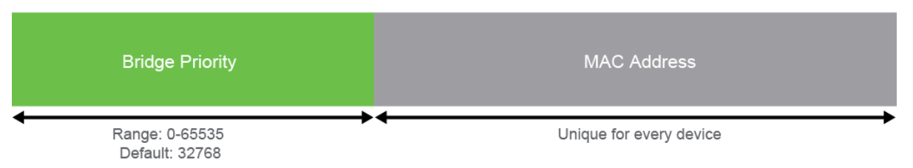

# Building Redundant Switched Topologies

## Physical Redundancy in LAN


## Issues in Redundant Topologies

Switches flood traffic to find peers and forward traffic.
When in a situation where switches infinitely connect to each other such as above issues arise.

So when it enters a value into it's MAC address table, it overwrites the previous entry (since only 1 MAC is allowed).  So it's just going to keep forever broadcasting, essentially DOS'ing everything on the network.

Generally almost always caused by people plugging things back into each other creating a loop.

## Spanning Tree Operation

You can't stop traffic being sent to you, you can only stop trying to process it.  So what we (STP) needs to do is block traffic from being sent.


So it finds the non-root member added and informs it to stop broadcasting on interface X where it was sending.

### Electing roots and members

1. The switches all boot up, and begin election.
2. They get each others Bridge ID's, and whoever has the smallest is elected root.
    1. Note that the IDs are per character _not_ overall. So take whichever character is first greatest.
    2. First root switch has all `designated ports`
3.  All devices directly connected to the root will have that interface assigned as a `root port`.
4.  Each switch not directly connected to the `root` switch will look to find which path has the shortest cost to the `root`, then set that interface as the `root port`, then `block` the other interfaces it's comparing to.  Tie breaking by Bridge ID.
5.  Step 4 repeats for each connection to the switch.

#### Port roles

```yaml
root: "Main"
root_port: "where to send traffic towards"
blocking_port: "Also known as a Blocked Port"
```

### STP Packet

#### Normal


#### Cisco
It just adds the VLAN into the value


## Types of Spanning Tree Protocol

### Types

  * STP (IEEE 802.1D)
    * legacy standard that provides a loop-free topology in a network with redundant links. STP creates a Common Spanning Tree (CST) that assumes one spanning tree instance for the entire bridged network, regardless of the number of VLANs. 
  * PVST+
    * Cisco enhancement of STP that provides a separate 802.1D spanning tree instance for each VLAN that is configured in the network. 
    * Preferable when Cisco only switches.
    * Most Cisco switches run this by default.
    * Enabled on all ports in VLAN 1
  * MSTP, or IEEE 802.1s, 
    * IEEE standard that is inspired by the earlier Cisco proprietary Multi-Instance STP (MISTP) implementation. MSTP maps multiple VLANs into the same spanning tree instance. 
    * Use when multiple vendors of switches
  * RSTP, or IEEE 802.1w, 
    * evolution of STP that provides faster convergence of STP. It redefines port roles and enhances BPDU exchanges. 
  * Rapid PVST+
    * Cisco enhancement of RSTP that uses PVST+. Rapid PVST+ provides a separate instance of 802.1w per VLAN. 

### Comparison

Protocol | Standard | Resources Needed | Convergence | Number of Trees
---|---|---|---|---  
STP | 802.1D | Low | Slow | One  
PVST+ | Cisco | High | Slow | One for every VLAN  
RSTP | 802.1w | Medium | Fast | One  
Rapid PVST+ | Cisco | Very high | Fast | One for every VLAN  
MSTP | 802.1s | Medium or high | Fast | One for multiple VLANs

    Above table should be committed to memory for exam

Why do some switches only allow a maximum number of VLANs?
> Due to STP, it'll have separate MAC addresses for each VLAN's mac address table.  So too many VLANs cause issues due to running out of memory.

Having a leaf switch being a `root` node for STP isn't explicitly as awful as commonly thought.  It's no ideal, but definitely not breaking.

TL;DR: 
> Traffic goes _towards_ the root, not _through_ the root.

Spanning tree uses non-linear weights for determining path costs.

IE: `19` is 100 Mbps

## PortFast and BDPU Guard

### Basic STP states:

* Blocking
* Listening
* Learning
* Forward

Starts out in the Listening state, all states have configurable delay timings.

#### PortFast Characteristics

* Immediate transition to forwarding state
* It should be configured only on ports not connected to other switches (IE: `access ports`)

#### BPDU Guard Characteristics

* If a 

## Rapid Spanning Tree Protocol

Rather old protocol often used as just a backup

`IEEE 802.1w RSTP`

* Designed for networks that allowed ~50 second delays
* Many odd proprietary mechanisms
* Slightly faster than `802.1D`
    * Backwards compatible with `802.1D`
* Requires full-duplex point-to-point connections

Very slow when calculating convergence.

### Roles:
* Root Port
* Designated Port
* Alternate / Backup Port
* Disabled
* In Transition


# Introducing OSPF

## Dynamic Routing Protocol

### RIP:
* Determine by number of (Bunny) Hops
* Constantly sending out information

### Classless vs Classful protocols
Classless can work on subnets, classful cannot.

## Path selection

Essentially just how distance numbers are calculated.

Route Source | Default Administrative Distance  
---|---  
Connected interface (and static routes via interface) | 0  
Static route (via next hop address) | 1  
External Border Gateway Protocol (EBGP) | 20  
EIGRP | 90  
OSPF | 110  
IS-IS | 115  
RIP | 120  
External EIGRP | 170  
Internal Border Gateway Protocol (IBGP) | 200  
Unreachable | 255 (will not be used to pass traffic)

## Link State Routing Protocol

Pros:
* Link-state protocols are more scalable. 
* Each router has a full map of the topology. 
* Updates are sent when a topology change occurs and are reflooded periodically. 
* Link-state protocols respond quickly to topology changes. 
* More information is communicated between the routers. 

## Link State Routing Protocol Data Structures

You have:
* Neighbor Tables
    *  Who's running the protocol with you
* Toplogy / Link State Database (LSDB)
    * Everything you know and have been told
    * Large table with directions to everywhere, all should have this as the same thing.
* Routing Table
    * Takes the Topology map, runs Dijkstra/SPF on it, and to determine to where to send to.

## Introducing OSPF (Actually)

AS: Autonomous System
ASBR: Autonomous System Boundary Router


### Functions
* Discover Neighbors
* Form adjacencies
* Flood LSAs
* Compute Shortest Path
* Install Routes
* Propagates and detect changes


## Establishing OSPF Neighbor Adjacencies

Each interface that participates in OSPF uses the all OSPF routers multicast
address 224.0.0.5 to periodically send hello packets. A hello packet contains
the following information:

  * Router ID: 
    * The router ID is a 32-bit number that uniquely identifies the router; it must be unique on each router in the network. The router ID is, by default, the highest IPv4 address on a loopback interface, if there is one configured. If a loopback interface with an IPv4 address is not configured, the router ID is the highest IPv4 address on any active interface. You can also manually configure the router ID by using the router-id command. Even though using a loopback IPv4 address is better approach than using a physical IPv4 address for a router ID, it is highly recommended to manually set the router ID. In this way, the router ID is stable and will not change, for example if an interface goes down. 
  * Hello and dead intervals:
    * The hello interval specifies the frequency in seconds at which a router sends hello packets to its OSPF neighbors. The default hello interval on broadcast and point-to-point links is 10 seconds. The dead interval is the time in seconds that a router waits to hear from a neighbor before declaring the neighboring router out of service. By default, the dead interval is four times the hello interval. These timers must be the same on neighboring routers; otherwise, an adjacency will not be established. 
  * Neighbors: 
    * The Neighbors field lists the adjacent routers from which the router has received a hello packet. Bidirectional communication occurs when the router recognizes itself in the Neighbors field of the hello packet from the neighbor. 
  * Area ID: 
    * To communicate, two routers must share a common segment and their interfaces must belong to the same OSPF area on this segment. The neighbors must also be on the same subnet (with the same subnet mask). These routers in the same area will all have the same LSDB information for that area. 
  * Router priority: 
    * The router priority is an 8-bit number. OSPF uses the priority to select a designated router (DR) and backup designated router (BDR). In certain types of networks, OSPF elects DRs and BDRs. The DR acts as a central exchange point to reduce traffic between routers. 
  * DR and BDR IPv4 addresses: 
    * These addresses are the IPv4 addresses of the DR and BDR for the specific network, if they are known. 
  * Authentication data: 
    * If router authentication is enabled, two routers must exchange the same authentication data. Authentication is not required, but if it is enabled, all peer routers must have the same key configured. 
  * Stub area flag: 
    * A stub area is a special area. Designating a stub area is a technique that reduces routing updates by replacing them with a default route. Two routers have to agree on the stub area flag in the hello packets to become neighbors. 

## OSPF Neighbor States

Basically, each node only states who it's neighbors are, how they get to them, and the cost of getting to them.  Then distributes that information to everyone.  It just shares link states instead of full databases.


### When the link is a multicast broadcast network
IE: A LAN

The `DR (Designated Router)` and `BR (Backup Router)` are responsible for calculating the flow of traffic and distributing the routing tables.  They are selected by highest priorities.

Dedicated OSPF multicast addresses:
* 224.0.0.6
    * `DR` multicast channel.
* 224.0.0.5
    * Used to communicate with all non `DR` routers.

### States

* Exstart State
    * Start
* Exchange State
    * Start sending and transferring requests
* Loading State
    * Load given info to table
    * Given by neighbors, but they don't actually change anything, all from `DR`.
* Full State
    * After link state acknowledgement
    * Basically good to go, nothing else needed.

Basically everything but acknowledgements and hellos require acknowledgements.

## SPF Algorithm

Values:
* Reference Bandwidth
    * Cost between links
* Interface Cost
    * Arbitrary cost values you can set
* Interface Bandwidth
    * Bandwidth

Look at [PacketLife](https://packetlife.net), specifically look at the cheat sheets (OSPF)

## Routing for IPv6

Routing Protocol | Full Name | RFC    
---|---|---  
RIPng | RIP next generation | 2080  
OSPFv3 | OSPF version 3 | 2740  
MP-BGP4 | Multiprotocol BGP-4 | 2545/4760  
EIGRP for IPv6 | EIGRP for IPv6 | Proprietary

# Exploring Layer 3 Redundancy

## Need for Default Gateway Redundancy

What happens if a gateway fails, that be it.

## Understanding FHRP

FHRP: First Hop Redundancy Protocol

Having 2 routers represented by 1:
1. Setup a Virtual Router
    * Creates a Virtual IP
    * Create virtual MAC
2. One is selected as forwarding, other is standby
    * Determined by election rules
    * Both have their own normal IPs and MAC
3. Virtual Router points to Forwarding Router
4. If forwarding router doesn't respond for awhile the standby router will send a "gratuitous ARP" telling the switch to update the table to point at it.

## Understanding HSRP
HSRP: Hot Standby Router Protocol

Has active and standby modes, basically the traffic is all sent to the virtual router and it forwards it to the active router.

### HSRP advanced features

Can track interfaces so that you can change priority link settings.  This is useful if a routers uplink goes down / degrades for some reason (preemption).

## Differences between FHRP and HSRP

FHRP: 
> Just updates MAC tables to specify where to send things
HSRP:
> Actively uses a virtual router to route traffic.

