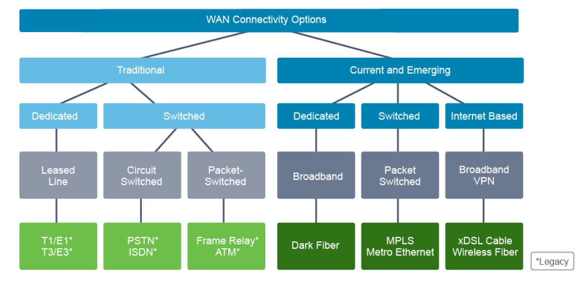
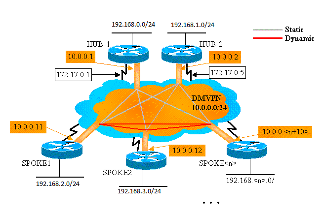

# 

## Exam notes

* Nothing timed counts against you, just right syntax counts towards.
* You cannot go back once answering a question.

## WAN devices and demarcation Points

WAN is the network neighboring your overall.

Focuses primarily on Layer 1 and 2

## WAN Topology Options

* Point to point
    * Dedicated Capacity of link
    * doesn't scale, costly
* Hub and spoke
    * Simple
    * suboptimal trafic
* Full mesh
    * Any to any connectivity
    * high redundancy
    * complex configuration, does not scale
* Mesh partial
    * Highly flexible
    * No full redundancy, costlier than hub n spoke

## WAN Connectivity Options



Legally speaking a Dedicated switch can only have 1 entity/company on it, but modernly that's not always how it works.

#### Minor trivia
Coax actually has a ton of bandwidth, more than fiber a decade ago, it just so happens that you were only specified to tune into one frequency at once.

### MPLS

Layer 2 and/or Layer 3

Packet label switching

Lots of terminology

IP and MAC addresses mean nothing, they're looking at a packets MPLS labels.

### Broadband

Telephone lines, less bandwidth with more distance.

* DSL
* VDSL

Look into Coax, DOCsis

#### Wireless

* Municipal WiFi
* Cellular/ Mobile
* Satellite
* WiMAX

#### Optical Fiber

##### FTTx

Fiber To The x

Fiber to homes, premises, building, neighbor, etc. (just replace X with first letter for variable)

##### SONET and SDH

SONET   STS Level | SONET  (OC Level) | SDH  (STM Level) | Bit Rate  [Mbps]  
---|---|---|---  
STS-1 | OC-1 | | 51.84   
STS-3 | OC-3 |  STM-1 | 155.52  
STS-12 | OC-12 | STM-4 | 622.08  
STS-48 | OC-48 | STM-16 | 2488.32  
STS-192 | OC-192 | STM-64 | 9953.28  
  
```yaml
STS: Synchronous Transport Signal
OC: Optical Carrier
STM: Synchronous Transport Module
```

##### DWDM

Optical Fiber Lang-Haul

Prisms to mux and demux light waves together across fiber

##### Dark Fiber

Unused fiber

### WAN Related Protocols

#### PPPP

### Enterprise Internet Connectivity

```yml
Single Home: 1 connection 1 ISP
Dual-Homed: Multiple connections to home from 1 ISP
Multihomed: 1 connection from multiple ISPs
Dual-Multihomed: Multiple connections from multiple ISPs
```

## Virtual Private Network (VPN)

Encrypted traffic over a network

RFC 2828

Two classifications points:
* Deployment Mode
    * Site to Site
        * Connects two networks together
    * Remote access
        * Connects an individual to an edge of a network endpoint 
* Underlying Technology
    * IPSec
    * SSL
    * MPLS
    * Hybrids

## Enterprise Managed VPNs

Connects 2 LANs together

### IPSEC
HAGGLE:
* (H)Hashing
* (A)uthentication
* (G)roup
    * Diffie hellman, etc.
* (L)ifetime
* (E)ncryption

Everything but lifetime needs to match

#### Generic Routing Encapsulation (GRE)

Tunnels broadcast and unicast traffic

You can use GRE underneath IPSEC

### SSL/TLS

Pretty basic Public Key methodologies with standard tech.
Specific Handshake 

## Provider Managed VPNs

### MPLS

Layer 2 MPLS
* Customer routers exchange routes directly
* Some applications require this

Layer 3 MPLS
* Customer routers exchange routes with service provided routers
* It providers Layer 3 service across the backbone.

### Dynamic Multipoint VPN (DMVPN)



Special tunnel interface

Cisco proprietary software solution that simplifies the device configuration when there is a need for many VPN connections. With Cisco DMVPN, a hub-and-spoke topology is normally  implemented first. The config of this network is managed by a multipoint GRE tunnel interfaces, established on the spoke hub. Multipoint in the name signifies that a single GRE interface can support multiple IPsec tunnels, with the Hub being the central knowledge point. The size of the configuration on the hub router remains constant even if you add more spoke routers to the network. The spokes are configured to establish a VPN connection with the hub. After building the hub-and-spoke VPNs, the spokes can obtain information about other spokes from the hub and establish direct spoke-to-spoke tunnels which enables them to dynamically generate the tunnels where required.

> The hub is **not** a central point where all data travels across, it just is responsible for answering queries about what tunnels to use.

# Explaining the Basics of ACLs

Executed the first rule

> At the end of every ACL list is an implicit `Deny all`

## Standard IP ACL Criteria

```sh
ip access-group 101 in
ip access-group PERMIT_ICMP out
```

## Extended IP ACL Criteria