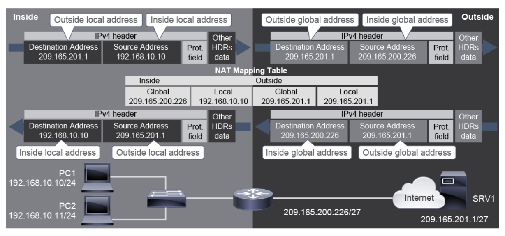
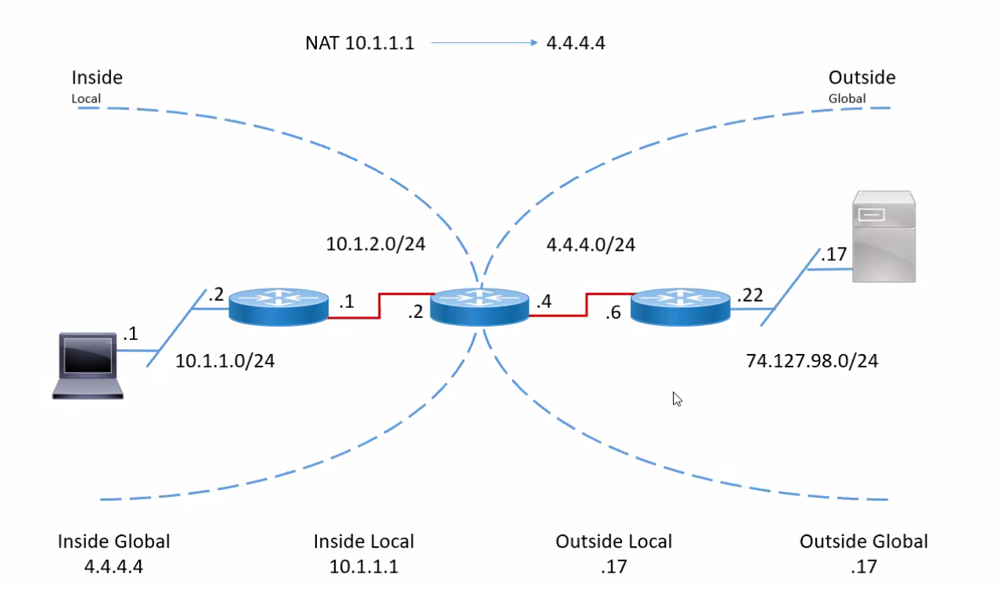

# Enabling Internet Connectivity

## Introducing Network Address Translation

NAT allows private users to access the same IP because:
* Limited IPv4 address space
* Private addresses are not routed by internet routers
* Private addresses solve IPv4 scarcity, but need to be translated.

### NAT Terminology and Translation Mechanism

Types
* Static NAT
    * one to one
* Dynamic NAT
    * Many to many
* PAT
    * Many to one

#### Packet


#### IP labeling

`Outside Local: 74.127.98.17`
`Outside Global: 74.127.98.17`

Terms:
* Inside Global
    * Inside network
    * From a Global perspective
    * TL;DR
        * The external Public IP from the internal network
* Inside Local
    * Inside Network
    * From a Local perspective
        * TL;DR
            * The internal network private IP
* Outside Local
    * Outside Network
    * From a Local perspective
        * TL;DR
            * Local outside (other) network private IP
* Outside Global
    * Outside network
    * From a Global perspective
        * TL;DR
            * The external Public ip of the 

## Benefits and Drawbacks of NAT

Pros
* Conserves IP Space
* Increases flexibility of connections
* Provides consistency for internal networking
* Provides network security
Cons
* End to end functionality is lost
    * including traceability
* Creates difficulty for some protocols
    * IE: IPSec, because it modifies headers
    * Services requiring initiation of TCP can be disrupted.
* Can degrade performance because of overhead

## Dynamic NAT
Dynamically allocate a pool of public IP addresses to your address space
with private IPs.
Once the pool runs out, you can't connect anymore until they're released.


## Configuring and Verifying inside IPv4 NAT

```sh
R1(config)# interface GigabitEthernet 0/1  
R1(config-if)# ip address 209.165.200.226 255.255.255.224  
R1(config-if)# ip nat outside  
R1(config-if)# exit  
R1(config)# interface GigabitEthernet 0/0  
R1(config-if)# ip address 172.16.1.1 255.255.255.0  
R1(config-if)# ip nat inside  
R1(config-if)# exit
```

### Static NAT
```sh
R1(config)# ip nat inside source static 172.16.1.10 209.165.200.230  
R1# show ip nat translations  
Pro Inside global Inside local Outside local Outside global  
tcp 209.165.200.230:1031 172.16.1.10:1031 209.165.202.155:23
209.165.202.155:23  
--- 209.165.200.230 172.16.1.10 --- ---
```

```sh
R2(config)# ip nat inside source static tcp 192.168.10.254 80 209.165.200.226
8080  
R2# show ip nat translations  
Pro Inside global Inside local Outside local Outside global  
tcp 209.165.200.226:8080 192.168.10.254:80  --- ---
```

```sh
Router(config)# access-list 1 permit 10.1.1.0 0.0.0.255  
Router(config)# ip nat pool NAT-POOL 209.165.200.230 209.165.200.235 netmask
255.255.255.224  
Router(config)# ip nat inside source list 1 pool NAT-POOL  
Router# show ip nat translations  
Pro Inside global Inside local Outside local Outside global  
icmp 209.165.200.230:3 10.1.1.100:3 209.165.202.155:3 209.165.202.155:3  
--- 209.165.200.230 10.1.1.100 --- ---  
icmp 209.165.200.231:1 10.1.1.101:1 209.165.201.25:1 209.165.201.25:1  
tcp 209.165.200.231:1030 10.1.1.101:1030 209.165.201.25:23 209.165.201.25:23  
--- 209.165.200.231 10.1.1.101 --- ---
```

### Configure PAT
```sh
Router(config)# access-list 1 permit 172.16.1.0 0.0.0.255  
Router(config)# ip nat inside source list 1 interface GigabitEthernet 0/1 overload  
Router# show ip nat translations  
Pro Inside global Inside local Outside local Outside global  
icmp 209.165.200.226:3 172.16.1.10:3 209.165.202.155:3 209.165.202.155:3  
icmp 209.165.200.226:1 172.16.1.9:1 209.165.201.25:1 209.165.201.25:1  
tcp 209.165.200.226:1030 172.16.1.9:1030 209.165.201.25:23 209.165.201.25:23  
tcp 209.165.200.226:1031 172.16.1.10:1030 209.165.201.25:23 209.165.201.25:23
```
The `overload` parameter is what makes PAT, PAT.

