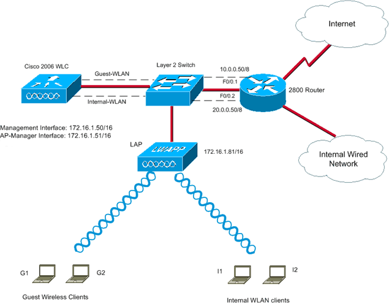
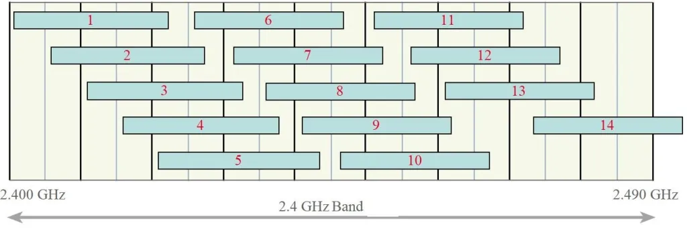
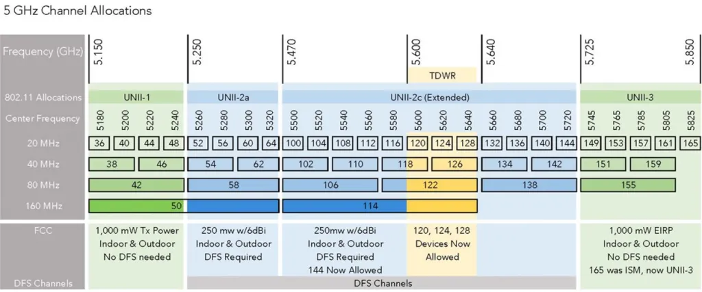

# Explaining Wireless Fundamentals


## Generic Topologies
`WPAN (Personal): ` 5-10M

`WLAN (Local): ` 100M <

`WMAN (Metro): ` 100M > 

## WLAN Architectures

### Ad Hoc
two devices wirelessly communicate via spamming basically

### WiFi Direct

Direct wifi from device to device

### Infrastructure Mod
AP is dedicated to centralized communication

* Functions as translational bridge for 802.3 wired and 802.11 wireless
* wireless is half duplex
* Base service area is also called a wireless cell
* BSS is service AP provides

### Service Set Identifier (SSID)

Name to bind to

#### Mapping SSIDs to VLANs

WLC separates traffic because they were wirelessly separate.

`WLC: ` Wireless LAN Control
* Basically the control center
* Every WAP is just an antenna for the WLC

### Centralized Wireless Architecture

Split MAC brings these:
* Centralized tunneling to WLC
* System wide coordination for wireless channel, rogue ap detection, interference

#### Control and Provisioning of Wireless Access Points
* CAPWAP is the industry standard for managing APs.
    * Uses UDP on IPv4 and IPv6.
    * Control plane is port 5246
    * Data plane uses port 5247



#### Switch config to support VLANs

Standalone AP needs to be a trunk, however with Centralized AP (CAPWAP),
it doesn't, only the CAPWAP does (because all traffic is tunneled to it).

##### Types of wifi VLANs
* WLC Management VLAN
* AP VLAN
* Data VLAN

Configuration on the Switch is exactly the same as anything else.

```sh
Switch# configure terminal  
Switch(config)# interface GigabitEthernet1/0/2  
Switch(config-if)# description AP1  
Switch(config-if)# switchport access vlan 12  
Switch(config-if)# switchport mode access
```

#### CAPWAP Communication

Just a tunnel, SSID is mapped to a VLAN ID.

WLC tags the data with the VLAN ID and sends it to the switch.

802.1Q allows trunking which just forwards IP

### Workgroup Bridge

Basically a relay for ethernet connection, just allows the APs to connect wirelessly.

### Mesh Networks

Allows wireless connections between each AP.

Each AP will have a dedicated controller for client serving and another for AP to AP connection.

## WiFi Channels
/ | 802.11 | 802.11a | 802.11b | 802.11g | 802.11n | 802.11ac  | 802.11ax
---|---|---|---|---|---|--- | ---
Operational frequency | 2.4 GHz | 5 GHz | 2.4 GHz | 2.4 GHz | 2.4 GHz and 5 GHz | 5 GHz   | 5 GHz
Data rates (Mbps) | 1, 2 | 6, 9, 12, 18, 24, 36, 48, 54 | 1, 2, 5.5, 11 | 1, 2, 5.5, 11, 6, 9, 12, 18, 24, 36, 48, 54 | Up to 600 | Up to 3500 | ?

### Channels can be broken down into bands

2.4 Ghz


5 Ghz



See [doc](https://systemzone.net/mikrotik-wifi-frequency-band-and-channel-width-explanation/)

### 802.11ax (Wi-Fi 6)

Not really included in most graphs because it's really new, see things like [Cisco's docs](https://www.cisco.com/c/en/us/products/wireless/what-is-802-11ax.html)

#### differences

2.4 GHz:
* Travels farther
* less bandwidth
5 Ghz:
* Travels less far
* more bandwidth

### Wireless radio interferers

basically anything else emitting RF

Also microwaves, motion detectors, and old flourescent lights

### DHCP

Basically the same, just passes the discover message up from the AP.

### Auth

Central server like RADIUS

Now for labs 22-28

## Interesting thing to look at:
https://getcertified4less.com/


# Introducing System Monitoring

## Syslog

Protocol that allows send event notifications across IP networks

You can configure it to send to
* Logging buffer
* Console Line
* Terminal Lines
* Syslog server

7 layers of debug logs

### Configuring

```sh
Router(config)# logging host 10.1.1.10  
Router(config)# logging trap informational  
Router(config)# logging source-interface Loopback0
```

## SNMP Overview

Components:
* Manager
    * Runs on server to access
    * Polls agents every so often
* Agent
    * Stores information
    * Responds to requests from Manager
* Management Information Base (MIB)
    * contains a database of objects

## NTP

### Manual time setting

#### Configure time
```sh
Router# show clock  
*00:30:04.966 UTC Fri Feb 14 1997  
Router# clock set 18:00:00 6 Apr 2019  
Router# show clock detail  
18:05:00.456 UTC Tue Apr 6 2019  
Time source is user configuration
```

#### Set timezone
```sh
Router# configure terminal  
Router(config)# clock timezone CET 1  
Router(config)# clock summer-time CEST recurring  
Router(config)# exit  
Router# show clock detail  
20:10:45.666 CEST Tue Apr 6 2019  
Time source is user configuration  
Summer time starts 02:00:00 CET Sun Mar 10 2019  
Summer time ends 02:00:00 CEST Sun Nov 3 2019
```

### Actually using NTP
```sh
Central(config)# ntp master 2  
Branch(config)# ntp server 209.165.201.1  
SW1(config)# ntp server 10.1.1.1
```

### Set a router as an NTP Server
```sh
Central(config)# interface Loopback 10  
Central(config-if)# ip address 192.168.255.1 255.255.255.0  
Central(config)# ntp master 2  
Central(config)# ntp source Loopback10
```