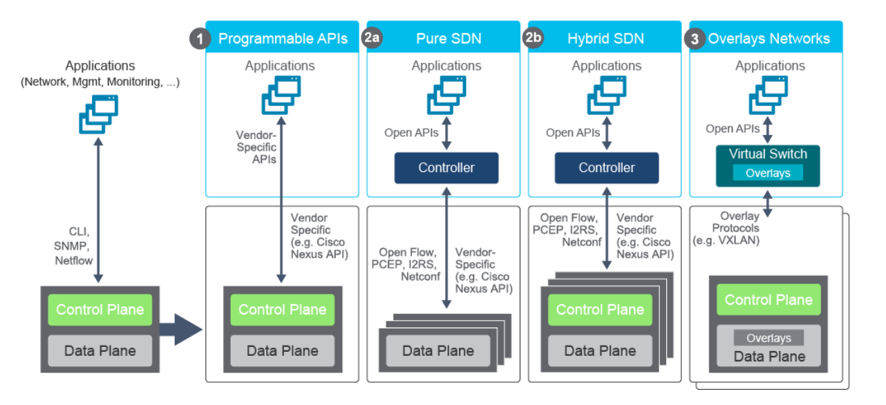

# Introducing Architectures and Virtualization

## Enterprise Three Tier Hierarchy

### Layers

* Access
* Distribution
* Core

### Access Layer

* User level access
* Lots of security

### Distribution Layer

* Interconnecting switches, 
* routing/packet manipulation
* Scaling

### Core Layer

* Nonstop, always available
* High speed forwarding between different distributions
* Simple or no policies
* Centralizes traffic to pass around.

## Spine-Leaf Network

Spines centralized

Leaves connect to spines

Servers connect to leaves

Spanning tree does not work for this.

## Cisco Enterprise Architecture Model

Modules:
* Enterprise Campus
    * consists of groups of buildings, in one network, uses 3 tier.
* Enterprise Edge
    * Provides connectivity from Enterprise Campus to outside the enterprise
* Service Provider Edge
    * Links connectivity between main site and remote locations
* Remote locations
    * Distant branch network office or remote data center.

## Cloud Computing Overview

Someone elses computer.

Types:
* Private
    * Single organization
* Community
    * Shared by several orgs
* Hybrid
    * Composed of two or more types of cloud
* Deployed by provider for public facing use

### Services

`* as a service`

Yes it exists, no it's not that different.

## Network Device Architecture

* Control Plane:
    * CPU
    * Decisions, algorithms
* Data Plane
    * ASICs
    * Just does things

### Software Defined Networks

Pulling the Control decisions out to another layer called the management plane.
Turning the Control plane into a very basic routing plane.  The management plane just makes decisions it isn't designed to move traffic.

## Virtualization Fundamentals

... nothing special here.

### Virtualizationf of Netowkring Functions

`VLAN: `Virtual Lan

`VRF: ` Routing and forwarding information is seperated from other VRFs.

# Explaining the Evolution of Intelligent Networks

Trendy Stuff

* DevOps
    * Automation
* Programmable Infrastructure
    * Repeatable infrastructure
* Open Source Software
    * More community support
    * Ability to help influence the direction of software to needs
        * or just make the changes yourself
* Software Defined Networking
    * Defining network controllers in software
* Intent Based Networking
    * Trend to focused on business goals and applications

## Software Defined Networks (SDN)

### SDN Types

SDN addresses:

* Centralized configuration, management control, monitoring
* ability to override forwarding behaviors
* Allows external applications or systems to influence network provisioning
* Rapidly scalable and buildable into life-cycle management.

### Traditional versus software defined network

Extracts config to management plain

#### Hybrid
Essentially the controller just configures some of the devices and those changes get propagated to the rest of the nodes.

## Common Programmability protocols and methods

* Use APIs
* Existing tooling
    * SNMP

## Configuration Management Tools

### Model Driven Programmability

### Data Models

### Encoding Formats

* JSON
* YAML
* XML

### NetConf
Used for retrieving and setting configs

### RESTConf
NetConf but REST

## Configuration Management Tools

* Puppet
* Chef
* Ansible
* Salt (Not mentioned in CCNA)

## Cisco DNA Center

Controller system that manages the entire network, mostly seen in Datacenters.

Hasn't been mentioned in CCNA yet, but it is heavily in 

Takes 128 CPU cores to run?

### Cisco SD Access

Like SDN

### SD-Access Fabric

`Underlay network: ` Pass that you can take

`Overlay network: ` Path that you will take

### SD-WAN

Makes all your WANs look like one

ONMP overlay management protocol