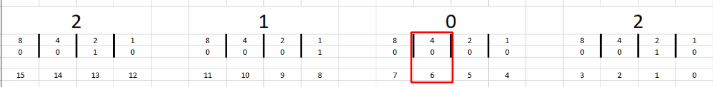

# Managing Cisco Devices

## Cisco IOS Integrated File System


## Stages of the router boot sequence

Stage | Name | Description
--- | --- | ---
ROM | POST | Normal POST
ROM | Bootstrap | Load bootstrap
Flash | Cisco IOS Software | Locate and Load OS
TFTP Server | Cisco IOS Software | Locate and Load OS
NVRAM | Configuration | Locate and load config files
TFTP Server | Configuration | Locate and load config files
Console | Configuration | Locate and load config files (Prompt user for initial config wizard)

## Loading and Managing system image files

### Config register
```sh
Branch(config)#  boot system flash:/c2900-universalk9-mz.SPA.152-4.M1.bin
```
```sh
Branch(config)# boot system tftp://c2900-universalk9-mz.SPA.152-4.M1.bin  
Branch(config)# boot system rom
```

### Loading IOS Image files
```sh
System Bootstrap, Version 15.0(1r)M15, RELEASE SOFTWARE (fc1)  
<... output omitted ...>  
Total memory size = 512 MB - On-board = 512 MB, DIMM0 = 0 MB  
CISCO2901/K9 platform with 524288 Kbytes of main memory  
Main memory is configured to 72/-1(On-board/DIMM0) bit mode with ECC enabled  
Readonly ROMMON initialized  
program load complete, entry point: 0x80803000, size: 0x1b340  
  
IOS Image Load Test  
Digitally Signed Release Software  
program load complete, entry point: 0x81000000, size: 0x5d433c0  
Self decompressing the image:
##########################################################################################################################[OK]  
<... output omitted ...>
```
```sh
Branch# show version  
Cisco IOS Software, C2900 Software (C2900-UNIVERSALK9-M), Version 15.2(4)M1,
RELEASE SOFTWARE (fc1)  
Technical Support: http://www.cisco.com/techsupport  
Copyright (c) 1986-2012 by Cisco Systems, Inc.  
Compiled Thu 26-Jul-12 20:54 by prod_rel_team  
ROM: System Bootstrap, Version 15.0(1r)M15, RELEASE SOFTWARE (fc1)  
Branch uptime is 39 minutes  
System returned to ROM by reload at 11:39:24 UTC Tue Nov 20 2012  
System image file is "flash0:c2900-universalk9-mz.SPA.152-4.M1.bin"  
Last reload type: Normal Reload  
Last reload reason: Reload Command  
Cisco CISCO2901/K9 (revision 1.0) with 483328K/40960K bytes of memory.  
Processor board ID FCZ1642C5XJ  
2 Gigabit Ethernet interfaces  
1 Serial(sync/async) interface  
1 terminal line  
DRAM configuration is 64 bits wide with parity enabled.  
255K bytes of non-volatile configuration memory.  
250880K bytes of ATA System CompactFlash 0 (Read/Write)  
<... output omitted ...>  
Configuration register is 0x2102
```

### Running config vs startup config

Config in ram
```sh
Branch# show running-config
```

Config in NVRam / disk
```sh
Branch# show startup-config
```

## Validating Images

MD5 checksum
```sh
Rtr-1# verify /md5 flash:/c2900-universalk9-mz.SPA.154-2.T1.bin  
......................................................................  
.........<…Output Omitted…>............................Done!  
verify /md5 (flash:/c2900-universalk9-mz.SPA.154-2.T1.bin) =
c1cb5a732753825baf9cs68d329a7be
```

## Managing images and configs
Ram to nvmram
```sh
R2# copy running-config startup-config  
R2# copy system:running-config nvram:startup-config
```

copy from ram to tftp server, overwriting
```sh
R2# copy running-config tftp:  
R2# copy system:running-config tftp:
```

copy from a remote source to running _merging_ configs
```sh
R2# copy tftp: running-config  
R2# copy tftp: system:running-config
```

copy a config from remote source to startup config, overwriting the file
```
R2# copy tftp: startup-config  
R2# copy tftp: nvram:startup-config
```

Wipe the startup config
```sh
erase startup-config
```

> Any loading of configs into running config while merge, not overwrite.

## Password recovery

Change configuration register value:

Change this bit


So `2102` -> `2142`

